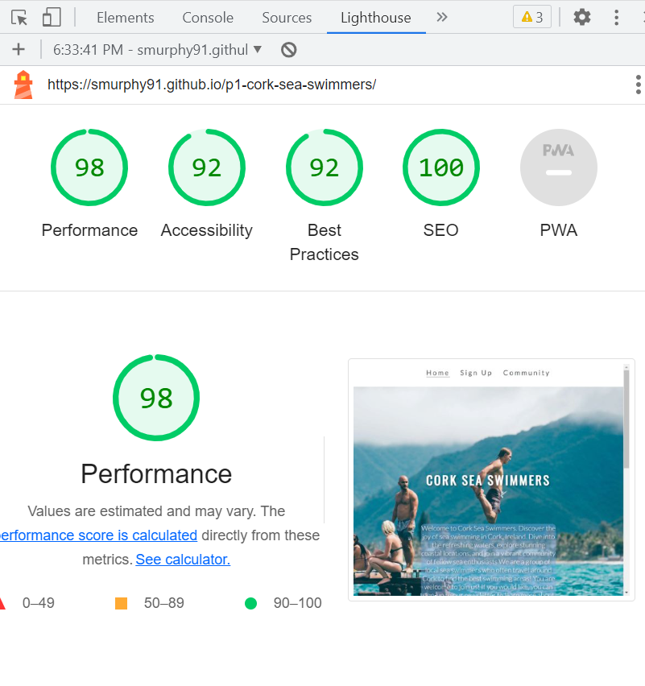

# Cork Sea Swimmers
## A website built for those intrested in Cork Sea Swimmin. This website informs the user of the benefits of sea swimming and a sign-up form.
### Project 1 - Shane Murphy

# 3 Page Website - home, sign up and image gallery(community)

# Cork Sea Swimmers

Welcome to the Cork Sea Swimmers website! This website is designed for individuals who are interested in sea swimming in Cork, Ireland. It provides information, resources, and a platform to connect with a vibrant community of sea enthusiasts.

## User Idea

The target audience for this website includes:

- Local residents of Cork who are passionate about sea swimming
- Individuals who want to explore sea swimming opportunities in Cork, Ireland
- Sea enthusiasts looking to connect with like-minded people and join a community

## Pages

The website consists of the following pages:

### Home (index.html)

The home page serves as the landing page of the website. It showcases the essence of sea swimming in Cork and introduces the Cork Sea Swimmers community. Users can find information about the benefits of sea swimming, coastal locations, and the invitation to join the community. The page also features a captivating hero image and an embedded YouTube video to engage and inspire visitors.

### Sign Up (signup.html)

The sign-up page allows users to join the Cork Sea Swimmers community. It contains a form where individuals can enter their details, including name and email address. Users can also indicate how they found out about the community and provide any additional messages. The page includes an option to subscribe to the email list and a "Sign Me Up!" button to submit the form.

### Community (community.html)

The community page emphasizes the importance and advantages of building a community. It highlights the benefits of networking, knowledge sharing, support, collaboration, innovation, and a sense of belonging. The page aims to inspire visitors to become part of the Cork Sea Swimmers community and experience these benefits firsthand. Additionally, the page features a gallery with images related to sea swimming and community activities.

## Purpose of the Website

The Cork Sea Swimmers website aims to achieve the following:

- Promote and raise awareness about sea swimming in Cork, Ireland
- Provide information about the benefits of sea swimming and coastal locations
- Build a community of sea enthusiasts who can connect, share knowledge, and support each other
- Encourage individuals to join the community, participate in sea swimming events, and explore the joy of swimming in the sea
- Serve as a platform for communication, updates, and future event announcements
-----------------------------------------------------------------------------------------------
# Sign Up Page

The Sign Up page on the Cork Sea Swimmers website allows individuals to join the community and stay connected with the sea swimming enthusiasts in Cork, Ireland.

## User Idea

The target audience for this page includes:

- Individuals who are interested in sea swimming in Cork, Ireland
- People who want to receive updates, event notifications, and news from the Cork Sea Swimmers community

## Form Details

The Sign Up page features a form where users can enter their details and join the Cork Sea Swimmers community. Here are the form fields and options:

- **Name**: Users can enter their name using a text input field. The field has a maximum character limit of 60.
- **Email**: Users can provide their email address using an email input field. The field has a maximum character limit of 60.
- **How did you hear about us?**: Users can select one option from a dropdown menu to indicate how they found out about the Cork Sea Swimmers community. The options include "Friend," "Google," and "Other."
- **Message**: A text area is provided where users can enter any additional messages or comments they may have.
- **Add me to the email list**: Users can check a checkbox to indicate their consent to be added to the email list.
- **Sign Me Up!**: A submit button is available for users to submit the form and join the community.

## Navigation

The Signup page includes a navigation bar at the top of the page. It allows users to access other pages of the website easily. The navigation menu includes the following options:

- **Home**: Takes users to the Home page (index.html).
- **Sign Up**: Highlights the current page (signup.html).
- **Community**: Takes users to the Community page (community.html).

## Footer

The page includes a footer section that contains social media links and the copyright notice. Users can click on the Facebook and Instagram icons to visit the Cork Sea Swimmers' social media pages.

---------------------------------

# Community

The Community page on the Cork Sea Swimmers website aims to build a strong and vibrant community of sea swimming enthusiasts in Cork, Ireland.

## Benefits of Building a Community

Building a community offers numerous benefits to its members. Here are some advantages highlighted on the Community page:

- **Networking Opportunities**: The community provides a platform for individuals to connect with like-minded people, expanding their professional network and creating new opportunities.
- **Knowledge Sharing**: Communities foster the sharing of knowledge, expertise, and best practices, allowing members to learn from one another and enhance their skills collectively.
- **Support and Encouragement**: Within the community, members find support, encouragement, and motivation, helping them overcome challenges and achieve their goals.
- **Collaboration and Innovation**: By bringing together diverse perspectives, communities encourage collaboration and spark innovation, leading to creative solutions and advancements.
- **Sense of Belonging**: Being part of a community gives individuals a sense of belonging and connection, creating a supportive and inclusive environment.

## Community Section

The Community page starts with a dedicated section emphasizing the importance and benefits of building a community. It highlights the advantages mentioned above and conveys the value of joining the Cork Sea Swimmers community.

## Image Gallery

The page includes an image gallery showcasing various images related to sea swimming and the community. The gallery aims to evoke a sense of interest and excitement among visitors, encouraging them to be part of the community.

## Navigation

The Community page includes a navigation bar at the top, allowing users to access other pages of the website easily. The navigation menu includes the following options:

- **Home**: Takes users to the Home page (index.html).
- **Sign Up**: Takes users to the Sign Up page (signup.html).
- **Community**: Highlights the current page (community.html).
# Testing
Tested using HTML and CSS validator

Also ran through Lighthouse in devtools to confirm that teh website was easy to read and accessible:
 "Employee Data title")

# Deployment
The website was deployed using Github
The live link can be found here [Cork Sea Swimmers](<https://smurphy91.github.io/p1-cork-sea-swimmers/>)

# Credits
**Images**
<https://unsplash.com/photos/PiPZ2DHa3rE>Courtesy of Jakob Owens <https://unsplash.com/@jakobowens1>

<https://unsplash.com/photos/3dK05zuot8c>Courtesy of Ahmed Nishaath <https://unsplash.com/@nihthu>

<https://unsplash.com/photos/341OczdirBM>Courtesy of Trend_io<https://unsplash.com/@trend_io>

Video:<https://www.youtube.com/watch?v=F8MIB9sbuug&ab_channel=JackORourke> (17) Sea Swimming, Jack O’Rourke (Dan Keaney) - YouTube
